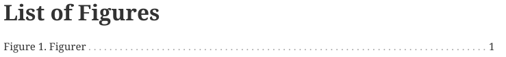
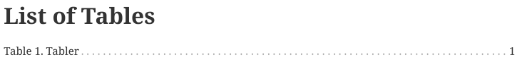
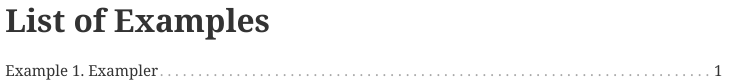
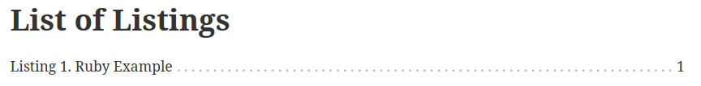
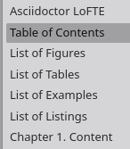
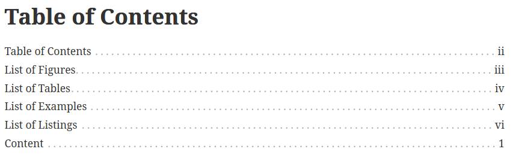

= Asciidoctor PDF LoFTE

This repository contains an .rb file which provides an extension for Asciidoctor-PDF which generates a *List of Figures* (LoF), a *List of Tables* (LoT), a *List of Examples* (LoE), and a *List of Listings* (LoL).

.List of Figures

.List of Tables

.List of Examples

.List of Listings


All these lists are styled to match the built-in Asciidoctor-PDF Table of Contents (ToC). 
In other words, each line contains the caption (signifier, counter, and title) along with a series of dots which lead to the page number.
A header is added at the top of each page.

Lists are also included in the PDF outline.

.PDF Outline


== Why?

Despite being _the best_ authoring tool around, the Asciidoctor ecosystem lacked built-in LoF, LoT, and LoE generation capability.
This made it difficult to convince users to adopt it because these sections are especially useful in a variety of fields.
With AsciiDoctor PDF LoFTE, feature parity with other authoring tools is within reach.

== How to Use

Complete these steps to use Asciidoctor LOFTE:

. Download the `asciidoctor-pdf-lofte.rb` 
. Add the desired list by adding the attributes to the `.adoc` file with the section titles:
.. `:lof-title:` List of Figures
.. `:lot-title:` List of Tables
.. `:loe-title:` List of Examples
.. `:lol-title:` List of Listings or List of Code Snippets
... When using `:lol-title:`, set the `:listing-caption:`, such as `Listing` or `Snippet`.
. Add figures, tables, examples, and listings to the document.
.. Add a title to each item. +
`.title`
.. Add an anchor to each item. +
`[#anchor]`
. Include the `:toc:` macroblock.
. Launch asciidoctor-pdf to generate the PDF + 
`asciidoctor-pdf -r ./asciidoctor-pdf-lofte.rb -a pdf-theme=runningcontent -a pdf-themesdir=resources/themes -a allow-uri-read asciidoctor-pdf-lofte-example.adoc`

[Note]
====
* To manually disable the inclusion of a list, simply leave the corresponding attribute blank or delete it.
* A list will not be printed if the document does not have that type of content (lists, examples, or figures). +
This ensures that blank lists are not added.
* A list will not be printed if it only contains untitled content.
* A list item will not printed if it does not have a title. +
To include an item, simply assign a title to it to make it appear.
====

=== Special Features
As of V1.2.0 it is possible to include the Table of Contents, List of Figures, List of Tables, List of Examples, and List of Listings inside the Table of Contents.

Enable this feature by including the `:include-lists-in-toc:` attribute.



== How it Works
This extension works by hooking into AsciiDoctor-PDF's built-in ToC generator.

* Multiple classes are used, four are for the lists, one for styling the ToC, one for the running content, and one for the outline .
* There is a lot of copy and pasting, but this seems to be necessary.
* No macroprocessor is available, such as lof::, lot::, loe:: or lol::.
* It is possible to re-order the sections by re-ordering the classes in this .rb file
* It is possible to manually modify the ToC look and feel by modifying `ink_toc`.

== Compatibility 
<<compatibleversion>> shows the verison of Asciidoctor pdf which Asciidoctor PDF LoFTE was developed and tested on.

[#compatibleversion]
.Compatible Version
```
$ asciidoctor-pdf -version 
Asciidoctor PDF 2.3.10 using Asciidoctor 2.0.20 [https://asciidoctor.org]
```

== Changelog

.Changes
[%header, cols="10,90"]
|===
|Version
|Changes

|V1.0.0 
a|* Initial Release

|V1.1.0 
a|* Added running content support. +
The \{chapter-title\} attribute now displays the list in the header and footer.
* Added outline support. +
Each list now appears in the PDF outline/bookmark after the Table of Contents.
* Bug fix: Incorrect attributes checked for each section due to lazy copy and pasting.
|V1.2.0 
a|* Fixed typos and bugs
* Added the ability to include the ToC, LoF, LoT, and LoE as entries inside the Table of Contents with the `:include-lists-in-toc:` attribute.
|V1.3.0 
a|* Added List of Listings; this is useful for source code snippets.
* Intermittent Bug: Lists may be double added to the PDF-Outline in certain conditions. 
Investigation in progress.
|===


== Future
This script might be turned into a stand-alone ruby gem when the author has time.


== Help and Support

The Asciidoctor community uses the https://asciidoctor.zulipchat.com/[Zulipchat - Asciidoctor] forums for discussion.